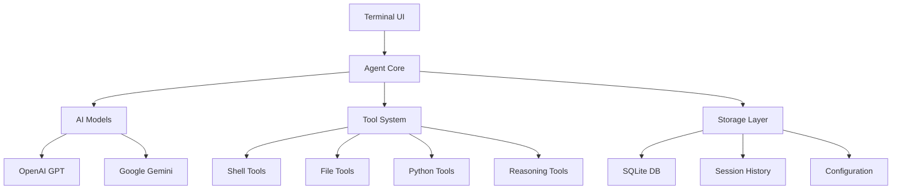

# 🤖 Neural Terminal - Intelligent Operations Terminal Assistant

<div align="center">

```
██████████████████████████████████████████████████
We are going to build AI Operating Systems. Before AGI. Join us :)
██    ┌─────┐  ████████ ██  ██ ████████         ██
██    │ ◉ ◉ │    ██     ██  ██ ██               ██
██    │  >  │    ██     ██████ ████             ██
██    └─────┘    ██     ██  ██ ██               ██
██               ██     ██  ██ ████████         ██
██                                              ██
██      █████╗ ██╗       ██████╗ ███████╗       ██
██     ██╔══██╗██║      ██╔═══██╗██╔════╝       ██
██     ███████║██║      ██║   ██║███████╗       ██
██     ██╔══██║██║      ██║   ██║╚════██║       ██
██     ██║  ██║██║      ╚██████╔╝███████║       ██
██     ╚═╝  ╚═╝╚═╝       ╚═════╝ ╚══════╝       ██
██                                              ██
██    ╔═══════════════════════════════════════╗ ██
██    ║ For Builders, From Neural Nirvana     ║ ██
██    ╚═══════════════════════════════════════╝ ██
██                                              ██
██████████████████████████████████████████████████
```

**Your AI-Powered System Administration Companion**

[](https://opensource.org/licenses/MIT)
[](https://www.python.org/downloads/)
[](https://github.com/psf/black)
[](http://makeapullrequest.com)

[Features](#-features) • [Installation](#-installation) • [Quick Start](#-quick-start) • [Documentation](#-documentation) • [Contributing](#-contributing)

</div>

---

## 🚀 What is IOTA?

**IOTA** (Intelligent Operations Terminal Assistant) is a cutting-edge AI-powered terminal assistant designed for system administrators, DevOps engineers, and tech enthusiasts who want to supercharge their command-line experience. Built for tinkerers and builders who demand both power and elegance.

### 🎯 Why IOTA?

- **🧠 AI-Native**: Leverage GPT-4, Gemini, and other leading AI models directly in your terminal
- **🔧 System-Aware**: Deep integration with your system for intelligent monitoring and management  
- **🎨 Beautiful UI**: Rich terminal interface that makes complex operations intuitive
- **🔌 Extensible**: Plugin architecture for custom tools and integrations
- **🛡️ Secure**: Local data storage with enterprise-grade security practices
- **⚡ Fast**: Optimized for performance with smart caching and async operations

---

## ✨ Features

### 🤖 AI-Powered Intelligence
- **Multi-Provider Support**: OpenAI GPT models, Google Gemini, and more
- **Context-Aware**: Understands your system state and provides relevant suggestions
- **Natural Language Interface**: Ask questions in plain English, get actionable results
- **Learning Capability**: Remembers previous interactions for better assistance

### 🖥️ System Administration
- **Real-time Monitoring**: CPU, memory, disk, network, and process analysis
- **Log Analysis**: Intelligent parsing and insights from system logs
- **Security Audits**: Automated security checks and recommendations
- **Performance Optimization**: System tuning suggestions based on usage patterns

### 🛠️ Developer Tools
- **Code Analysis**: Review and optimize scripts with AI assistance
- **Deployment Automation**: Streamline DevOps workflows
- **Environment Management**: Virtual environments, containers, and dependencies
- **Git Integration**: Intelligent version control operations

### 🎨 User Experience
- **Rich Terminal UI**: Beautiful, responsive interface with syntax highlighting
- **Command History**: Smart search and replay of previous operations
- **Export Functions**: Save sessions, generate reports, and share insights
- **Customizable**: Themes, aliases, and personalized workflows

### 🔌 IoT & Edge Computing
- **Device Management**: Monitor and control connected IoT devices
- **Edge Deployment**: Deploy and manage edge computing workloads
- **Sensor Data**: Real-time sensor monitoring and analytics
- **Automation**: Smart home and industrial automation capabilities

---

## 📦 Installation

### Prerequisites
- Python 3.8 or higher
- Terminal with UTF-8 support
- OpenAI API key or Google AI API key

### Quick Install

```bash
# Clone the repository
git clone https://github.com/neural-nirvana/iota.git
cd iota

# Create virtual environment
python -m venv venv
source venv/bin/activate  # On Windows: venv\Scripts\activate

# Install dependencies
pip install -r requirements.txt

# Run IOTA
python main.py
```

### Package Installation (Coming Soon)
```bash
pip install iota-terminal
```

### 📱 Executable Downloads
Pre-built executables for Windows, macOS, and Linux are available in our [Releases](https://github.com/neural-nirvana/iota/releases) section.

---

## 🚀 Quick Start

### 1. First Launch
```bash
python app.py
```

### 2. Configure Your AI Provider
```bash
# In IOTA terminal
config
# Follow the setup wizard to add your API keys
```

### 3. Start Exploring
```bash
# System analysis
analyze system performance

# File operations  
find large files in /var/log

# Process management
show me running python processes

# Quick shell commands
!df -h
!top -n 1

# Ask anything!
help me optimize this server for web hosting
```

### 4. Advanced Usage
```bash
# Export session
export

# View history
history

# System stats
stats

# Custom automation
create a backup script for my database
```

---

## 🎬 Demo

### Basic System Analysis
```bash
agent[1]> analyze disk usage and show me the top 10 largest directories

🔍 Analyzing disk usage across your system...

📊 Top 10 Largest Directories:
┌─────────────────────────────────┬──────────┬─────────────┐
│ Directory                       │ Size     │ % of Total  │
├─────────────────────────────────┼──────────┼─────────────┤
│ /var/lib/docker                 │ 15.3 GB  │ 23.5%       │
│ /usr/lib/x86_64-linux-gnu       │ 8.7 GB   │ 13.4%       │
│ /home/user/.cache               │ 4.2 GB   │ 6.5%        │
└─────────────────────────────────┴──────────┴─────────────┘

💡 Recommendations:
• Docker images can be cleaned up with: docker system prune
• Cache directory is large - consider clearing browser caches
• Monitor /var/lib/docker growth for container sprawl
```

### AI-Powered Code Review
```bash
agent[2]> review my Python script deployment.py and suggest improvements

📝 Code Analysis Complete!

🔍 Found 3 optimization opportunities:
1. **Security**: Hardcoded credentials detected (line 23)
   → Recommendation: Use environment variables or secrets manager

2. **Performance**: Synchronous HTTP calls in loop (lines 45-52)  
   → Recommendation: Implement async/await pattern for 3x speed improvement

3. **Error Handling**: Missing exception handling for network calls
   → Recommendation: Add retry logic with exponential backoff

🚀 Auto-generated improved version saved to: deployment_optimized.py
```

---

## 📖 Documentation

### Configuration
IOTA stores configuration in SQLite database for persistence and performance:

```python
# Configuration structure
{
    "agent": {
        "provider": "openai",  # or "google"
        "model": "gpt-4o-mini",
        "temperature": 0.7,
        "max_tokens": 2000
    },
    "ui": {
        "show_tool_calls": true,
        "markdown": true,
        "theme": "default"
    }
}
```

### Available Commands
- `help` - Show available commands
- `config` - Configure AI providers and settings
- `clear` - Clear the terminal screen
- `history` - Show command history
- `stats` - Display session statistics
- `export` - Export conversation to file
- `reset` - Start a new session
- `exit/quit` - Exit IOTA

### Special Prefixes
- `!<command>` - Execute shell command directly
- `?<query>` - Quick system information query

### Tool Integration
IOTA includes several built-in tools:
- **ReasoningTools**: AI-powered analysis and decision making
- **ShellTools**: System command execution and analysis
- **FileTools**: File system operations and management
- **PythonTools**: Python code execution and debugging

---

## 🏗️ Architecture



---

## 🤝 Contributing

We welcome contributions from developers, system administrators, and AI enthusiasts! Here's how you can help:

### 🐛 Bug Reports
- Use the [issue tracker](https://github.com/neural-nirvana/iota/issues)
- Include system information and reproduction steps
- Attach relevant logs from `logs/sita.log`

### 💡 Feature Requests  
- Describe your use case and proposed solution
- Check existing issues to avoid duplicates
- Consider implementing it yourself - we provide mentorship!

### 🔧 Development Setup
```bash
# Fork and clone the repository
git clone https://github.com/YOUR_USERNAME/iota.git
cd iota

# Install development dependencies
pip install -e ".[dev]"

# Run tests
pytest

# Format code
black .
isort .

# Submit a pull request!
```

### 📋 Development Guidelines
- Follow PEP 8 style guidelines
- Add tests for new features
- Update documentation
- Use conventional commit messages

---

## 🗺️ Roadmap

### v1.1 - Enhanced Intelligence
- [ ] Plugin system for custom tools
- [ ] Web interface option
- [ ] Docker integration
- [ ] Cloud provider integrations (AWS, GCP, Azure)

### v1.2 - Enterprise Features  
- [ ] Multi-user support
- [ ] Role-based access control
- [ ] Audit logging
- [ ] API endpoints for automation

### v1.3 - Advanced AI
- [ ] Custom model training
- [ ] Workflow automation
- [ ] Predictive maintenance
- [ ] Natural language scripting

### v2.0 - Ecosystem
- [ ] Mobile companion app
- [ ] GUI dashboard
- [ ] Marketplace for plugins
- [ ] Enterprise SaaS offering

---

## 📊 Metrics & Performance

- **⚡ Response Time**: < 200ms for local operations
- **🧠 AI Latency**: ~1-3s for AI-powered responses
- **💾 Memory Usage**: ~50MB base footprint
- **🔋 CPU Impact**: < 5% during normal operation
- **📦 Binary Size**: ~25MB standalone executable

---

## 🌟 Community

Join our growing community of tinkerers and builders:

- **Discord**: [Join our server](https://discord.gg/neural-nirvana) for real-time discussions
- **Reddit**: [r/NeuralNirvana](https://reddit.com/r/neuralnirvana) for tips and showcases
- **Twitter**: [@neural_nirvana](https://twitter.com/neural_nirvana) for updates
- **Blog**: [blog.neural-nirvana.com](https://blog.neural-nirvana.com) for tutorials

---

## 🏆 Showcase

*Share your IOTA workflows and automations! Submit a PR to add your use case here.*

### DevOps Automation
> "IOTA helped me reduce deployment time by 80% through intelligent error detection and automated rollback procedures." - @devops_ninja

### Home Lab Management  
> "Managing my Raspberry Pi cluster became effortless with IOTA's IoT integration." - @homelabber

### Security Auditing
> "The AI-powered security recommendations caught vulnerabilities I would have missed." - @77ethers

---

## 📄 License

This project is licensed under the MIT License - see the [LICENSE](https://mit-license.org/) file for details.

---

## 🙏 Acknowledgments

- **[Agno Framework](https://github.com/agno-ai/agno)** - The powerful AI agent framework powering IOTA
- **[Rich](https://github.com/Textualize/rich)** - Beautiful terminal formatting
- **OpenAI & Google** - AI model providers
- **Our Contributors** - The amazing developers making IOTA better every day

---

<div align="center">

**Made with ❤️ by the Neural Nirvana Team**

*For tinkerers and builders who refuse to settle for ordinary.*

[⭐ Star this repo](https://github.com/neural-nirvana/iota) • [🍴 Fork it](https://github.com/neural-nirvana/iota/fork) • [📢 Share it](https://twitter.com/intent/tweet?text=Check%20out%20IOTA%20-%20AI-powered%20terminal%20assistant!&url=https://github.com/neural-nirvana/iota)

</div>
